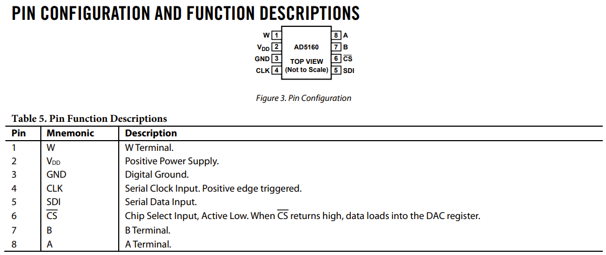
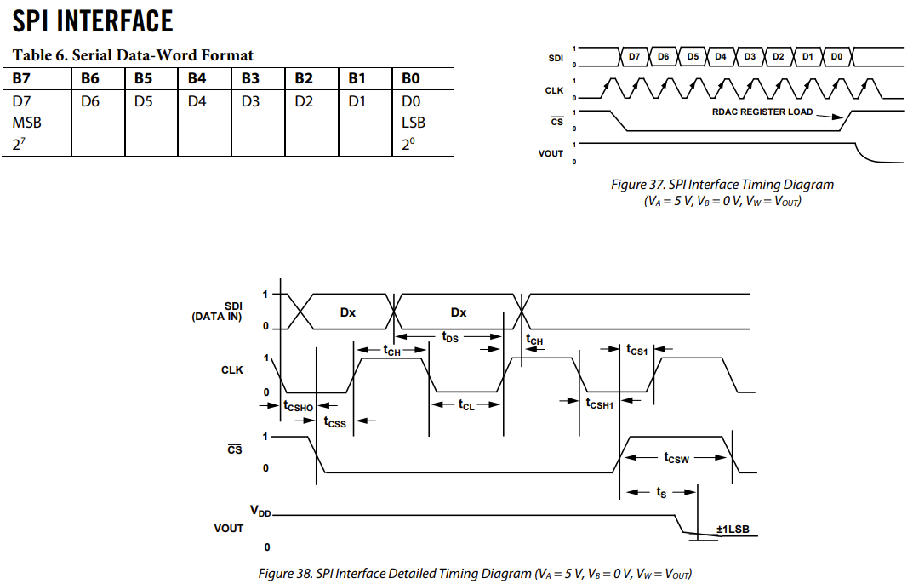

# esp32-pmod-dpot
ESP32를 이용한 Digilent Pmod DPOT(Digital Potentiometer) 제어 예제 프로젝트

요구사항
---
espressif의 esp-idf가 필요하다. (submodule로 정의되어 있음)<br>
esp-32 관련 모든 기능은 esp-idf를 통해 구현되었다.<br>
:warning: 추후 Matter 연동 프로젝트를 위해 v4.4.3으로 서브모듈 추가해둠
```shell
git submodule update --init
source ./sdk/esp-idf/install.sh
```

보드 핀맵
---
[definition.h 헤더파일](https://github.com/YOGYUI/esp32-pmod-dpot/blob/main/main/include/definition.h)에 SPI 관련 핀맵이 정의되어 있다.
```c
// SPI setting
#define DPOT_SPI_HOST       HSPI_HOST
#define PIN_DPOT_SPI_MOSI   13
#define PIN_DPOT_SPI_MISO   12
#define PIN_DPOT_SPI_SCLK   14
#define PIN_DPOT_SPI_CS     15
```
- MOSI: GPIO 13
- MISO: GPIO 12 (Pmod DPOT는 연결할 필요 없음)
- SCLK: GPIO 14
- <span style="text-decoration:overline">CS</span>: GPIO 15

디지털 가변저항 (AD5610)
---
자세한 내용은 데이터시트([AD5160](https://www.analog.com/media/en/technical-documentation/data-sheets/AD5160.pdf))를 참고.



구현내용
---
- HSPI(SPI2) Mater 모드로 AD5160에 저항 설정값을 전달
- Wi-Fi SoftAP 모드 활성화 (SSID: **YOGYUI-ESP32-TEST**)
- HTTP 서버를 통해 저항값 제어 (Port: **80**)
    - Vue front-end framework
    - SoftAP 접속 후 브라우저에서 **10.11.12.1**로 접속 (DHCP)
    - TODO: Webpack 기반으로 프로젝트 생성하여 페이지 초기 로드가 느림

펌웨어 빌드 및 업로드
---
1. esp-idf 빌드 환경 준비
    ```shell
    source ./sdk/esp-idf/export.sh
    ```
2. 빌드 타겟 지정 (ESP32): sdkconfig 설정파일 생성<br>
   플래시 영역 사이즈 4MB 설정, 커스텀 파티션 파일 (partitions.csv) 설정 (for SPIFFS)
    ```shell
    idf.py set-target esp32
    ```
3. 펌웨어 소스코드 빌드 (/build/yogyui-esp32-pmod-dpot.bin)
    ```shell
    idf.py build
    ```
4. 펌웨어 바이너리 파일 업로드
    ```shell
    idf.py -p /dev/ttyUSB0 flash
    ```
5. (optional) 웹서버용 파티션 이미지 생성 및 업로드 (SPIFFS)<br>
    esp-idf의 parttool.py, spiffsgen.py, esptool.py를 이용해야 하는데, 과정이 복잡하여 쉘스크립트로 자동화해두었다
   - Vue 프로젝트 빌드 (webpack)
        ```shell
        source ./script/build_web_resource.sh
        ```
   - 웹서버 파티션 이미지 플래시 업로드
        ```shell
        source ./script/flash_web_resource.sh
        ```

데모
---
TODO: gif, webpage screen shot
